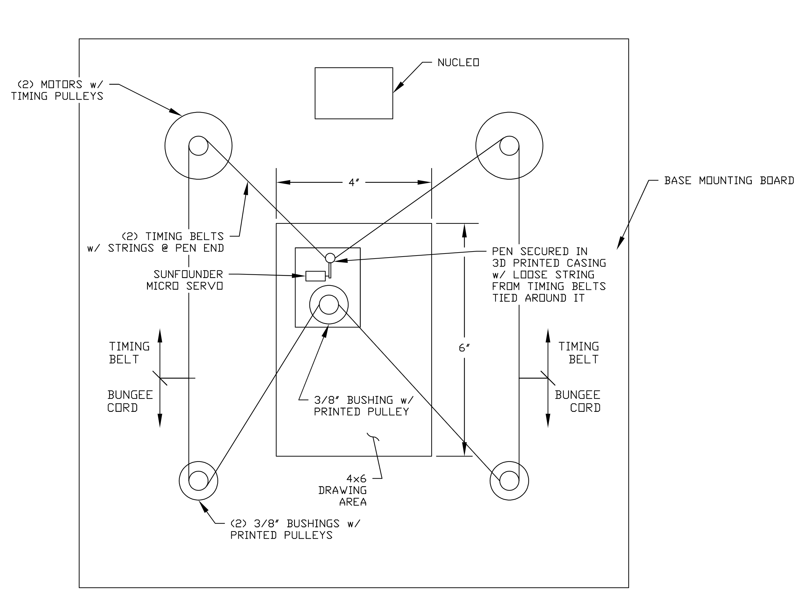
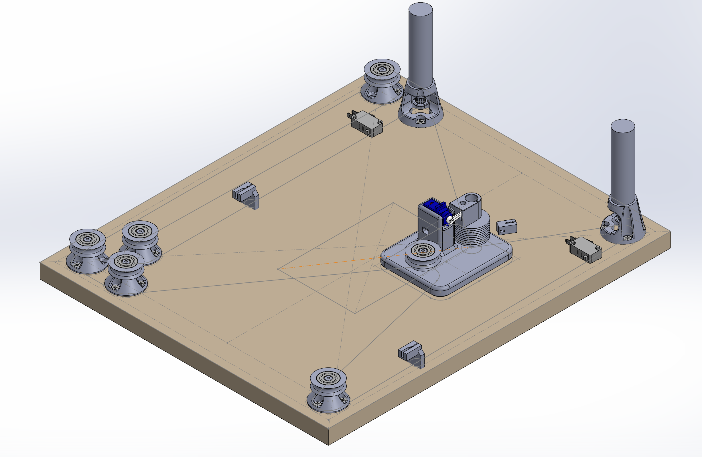

# ME405 Master Plotters
### A ME 405 term project that documents a pen plotter design.

The design we're going with is inspired by this YouTube video by DAZ projects: 

[the SIMPLEST cnc PEN PLOTTER | how to build it](https://www.youtube.com/watch?v=zFRRUZdz1HY)

Although we're taking inspriation from this design, we are making some changes that we believe will improve
its performance. The basic layout of this design is a 2.5-D pen plotter that is laid out horizontally on a flat base. The base is
is going to be a rectangular plywood piece with pulleys at each corner. There will be two gearmotors driving the pen plotter placed
at two adjacent corners (see sketch). The two motors will directly drive the two pulleys at the corners of the base, and the two other 
pulleys will be idlers which guide the belt. They will make the belt form one continuous loop in an hourglass shape.
Instead of using string like the video, we will use a GT2 timing belt to increase the traction on the pulley because of the teeth
present on the pulley wheels and the belts, and eliminate slipping. Since the total length of the belt will change slightly as the pen moves,
we will use a stretchy paracord joined with the timing belt to provide some room for movement while keeping tension. To actuate the pen and lift it
off of the paper when moving between drawn lines, we'll use a small servo that activates to lift the pen within its holder. This holder will have
ball rollers on the bottom to allow it to move smoothly over the paper.

A rough bill of materials is shown below. We're keeping the main motors simple and efficient by using the equipment available to us in lab. The GT2 belt and
pulleys will be purchased from Amazon and other components to hold the pen and servo and to mount the motors will be 3D printed by our group.

## Bill of Materials
| Qty. | Part                           | Source                | Est. Cost |
|:----:|:-------------------------------|:----------------------|:---------:|
|  2   | Pittperson Gearmotors          | ME405 Tub             |     -     |
|  1   | Nucleo with Shoe               | ME405 Tub             |     -     |
|  1   | GT2 Timing Belt                | Amazon                |   $6.99   |
|  1   | GT2 Timing Pulleys             | Amazon                |   $7.99   |
|  1   | Mini Ball Transfer Bearing     | Amazon                |   $10.95  |
|  6   | Skateboard Bearings            | Jackson               |     -     |
|  1   | Sunfounder Micro Servo         | Charlie               |     -     | 
|  1   | Bungee Cord 1/8" Diameter      | Amazon                |   $5.95   | 
|  1   | Small String                   | Tori                  |     -     |

## Preliminary System Sketch
|  |
|:--:|
|**Figure 1: Scaled sketch showing the basic layout of our planned plotter**|

## Hardware Design
|  |
|:--:|
|**Figure 2: CAD Model showing final version of Pen Plotter**|

The hardware we are using is mostly 3D printed from CAD designs created in Solidworks. The main components are the motor mounts, paracord pulleys, 
the pen carriage, and servo mount for actuating the pen.

## Software Design
The software we designed uses a task based approach to update encoder positions and control set points based on a given HPGL file. The first process
to run is the start up process that zeros our encoders and puts the pen carriage in a known home position for us to use as a reference point to calculate 
set points from the HPGL file. The parsed HPGL file gives coordinates in the form of encoder ticks using a coordinate transformation that calculates it 
based on the HPGL and then sets the set point for each motor individually. The controller and encoder constantly update and share the data they collect
to tell whether the pen has reached the proper set point. 

## Results

## Additional Links

